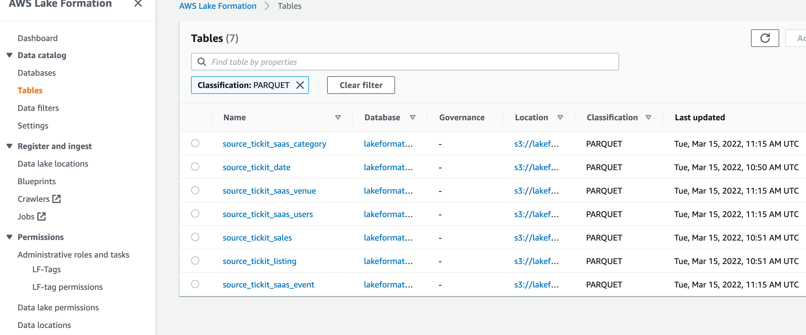

# lakeformation-airflow-demo

## Architecture landscape

## mysql DB

## postgresql DB

#### [1] execute to prepare the env

> export AWS_DEFAULT_REGION=eu-west-2 \
  export AWS_DEFAULT_PROFILE=development

#### [2] execute the infrastructure

> terraform init \
> terraform apply -auto-approve \
> terraform show -json

#### [3] Create the blueprint
##### [3.1] login using created lake admin user lakeformation-airflow-demo-admin-user
##### [3.2] create lakeformation blueprints[ AWS Lake Formation > Blueprints]
###### lakeformation mysql blueprint

###### lakeformation postgresql blueprint

#### [4] Orchestrate DAGS
##### [4.1] execute dags from MWAA UI

#### [5] check Lake databases tables
